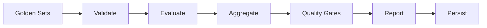
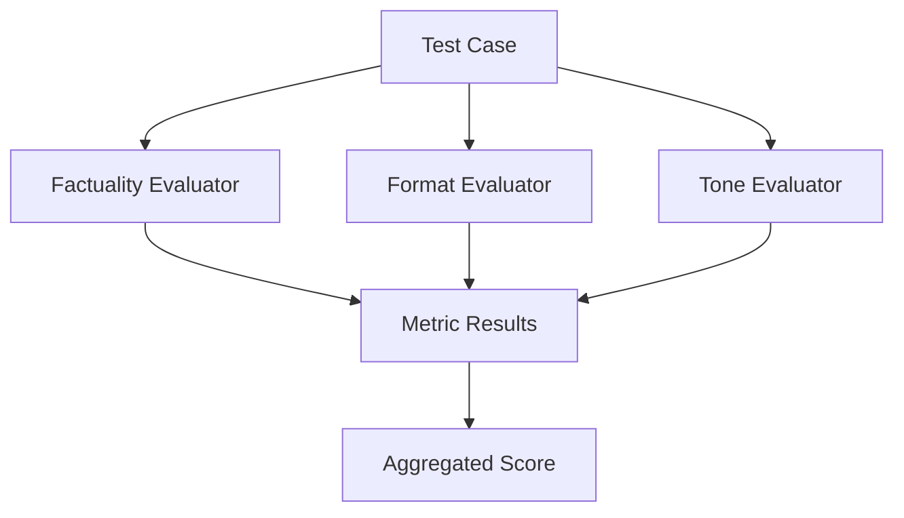
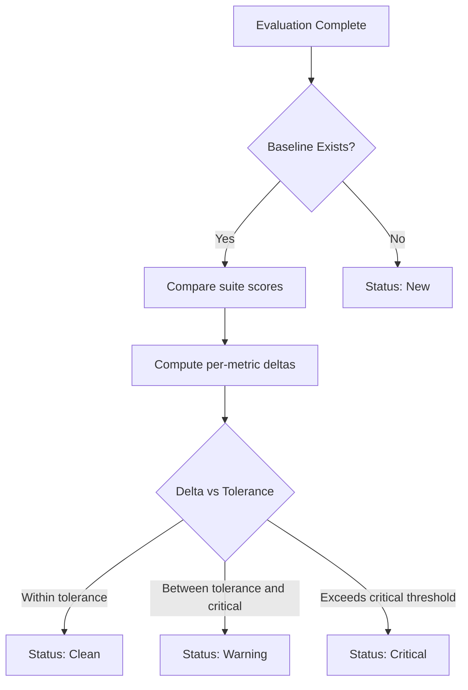
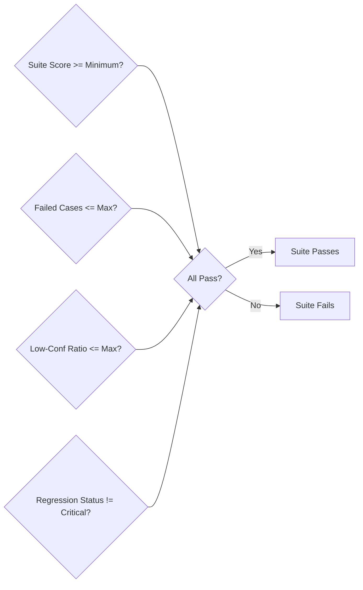
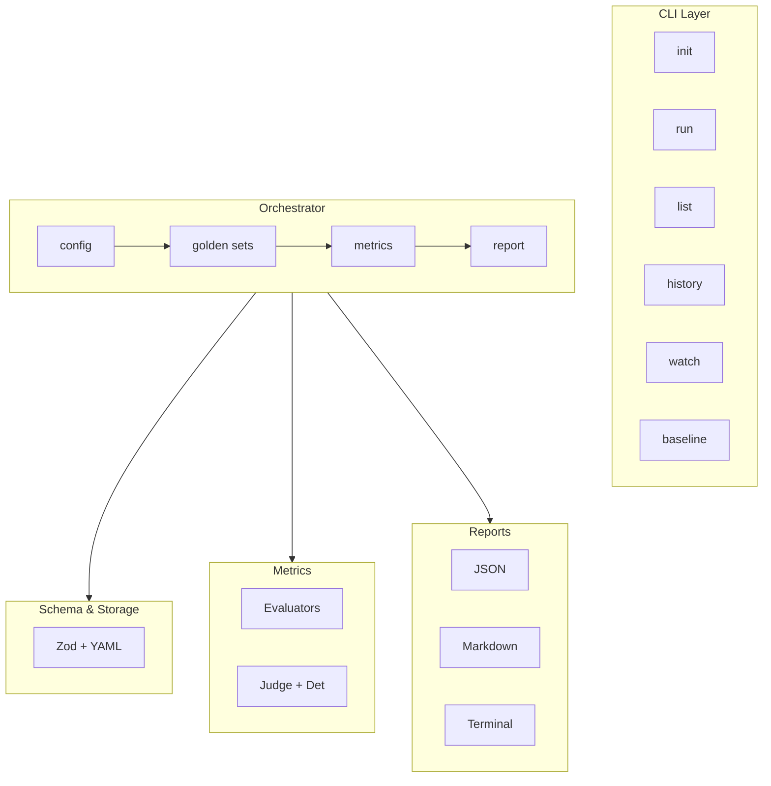

Regtrace is a CLI tool that compares LLM outputs against golden set
expectations and reports whether quality is maintained or degraded.

## High-level flow

Each run is:

1. **Load** — read config and golden set files
2. **Validate** — check schema, semantic rules, no all-null actual_output
3. **Evaluate** — for each test case, run each enabled metric
4. **Aggregate** — combine scores using weighted averaging
5. **Check gates** — compare quality metrics against configured thresholds
 6. **Report** — print to terminal (stderr), JSON (stdout), or Markdown (file)
 7. **Persist** — save the run record to `.regtrace/runs/`

## Evaluation pipeline

For each test case:

Each evaluator produces a score (0.0–1.0), a pass/fail decision, confidence
level, and an explanation.

## Regression comparison

After evaluation, Regtrace checks for an existing baseline:

## Quality gates

Quality gates are final pass/fail checks:

## Run storage

Run records are JSON files stored in `.regtrace/runs/`. Each file contains
the full evaluation result, config snapshot, and metadata. Stored runs allow
listing, history review, and regression comparison.

## Architecture layers

