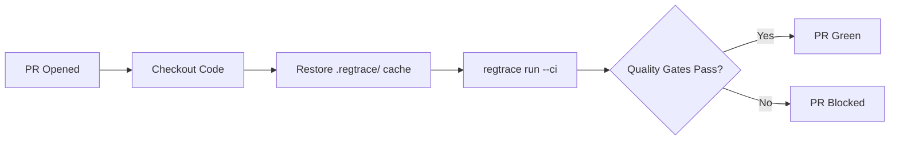
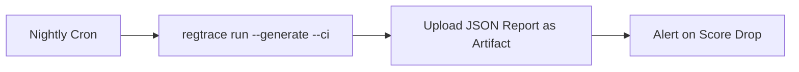

Regtrace produces exit codes, machine-readable output, and regression baselines,
making it a natural fit for CI/CD. Integrate it with any pipeline that can run
a binary and check its exit code.

## Why Regtrace in CI

Regtrace in CI answers three questions:

| Use case | What it catches | When to run |
|---|---|---|
| **PR regression gate** | Prompt edit or model swap drops quality | On pull request |
| **Generate + evaluate on schedule** | LLM output quality degrades over time | Nightly / weekly cron |
| **Trend monitoring** | Slow score drift across releases | Every push to main |

### PR regression gate

Block PRs that degrade LLM output quality. Run evaluation, check quality gates,
fail the pipeline if scores drop or regression exceeds threshold.



### Generate + evaluate on schedule

Some teams evaluate LLM outputs generated fresh each run rather than pre-written
golden sets. Run `--generate` on a schedule, evaluate, and track trends.



### Trend monitoring

Use `regtrace list --format json` to extract historical scores, plot them, or
alert when a moving average crosses a threshold. Run each merge to main.

## Quick setup

<Steps>
  <Step>
    ### Download the binary in your pipeline

    <Callout type="info">
      Regtrace is a standalone binary — no runtime dependencies, no npm install,
      no Docker needed.
    </Callout>

    Release URLs mirror the pattern:
    ```
    https://github.com/decimozs/regtrace/releases/latest/download/regtrace-{platform}
    ```

    <Tabs items={['GitHub Actions', 'GitLab CI', 'CircleCI']}>
      <Tab value="GitHub Actions">
        ```yaml
        - name: Download Regtrace
          run: |
            curl -L -o /usr/local/bin/regtrace \
              https://github.com/decimozs/regtrace/releases/latest/download/regtrace
            chmod +x /usr/local/bin/regtrace
        ```
      </Tab>
      <Tab value="GitLab CI">
        ```yaml
        before_script:
          - curl -L -o /usr/local/bin/regtrace \
              https://github.com/decimozs/regtrace/releases/latest/download/regtrace
          - chmod +x /usr/local/bin/regtrace
        ```
      </Tab>
      <Tab value="CircleCI">
        ```yaml
        - run:
            name: Download Regtrace
            command: |
              curl -L -o /usr/local/bin/regtrace \
                https://github.com/decimozs/regtrace/releases/latest/download/regtrace
              chmod +x /usr/local/bin/regtrace
        ```
      </Tab>
    </Tabs>
  </Step>
  <Step>
    ### Run evaluation

    ```bash
    regtrace run --ci
    ```

    The `--ci` flag:
    - Suppresses color output
    - Prints a visible CI-mode notice
    - Exits with code 1 if any quality gate fails
  </Step>
  <Step>
    ### Check exit code

    | Code | Meaning |
    |------|---------|
    | 0 | All quality gates passed |
    | 1 | One or more quality gates failed |
    | 2 | Config or schema error — evaluation did not run |

    Exit code 1 fails your pipeline step. Exit code 2 indicates a setup
    problem (invalid config, missing golden set).
  </Step>
</Steps>

## GitHub Actions

### PR regression gate

Block PRs where quality drops below threshold:

```yaml
name: LLM Quality Gate

on:
  pull_request:

jobs:
  evaluate:
    runs-on: ubuntu-latest
    steps:
      - uses: actions/checkout@v4

      - name: Cache regtrace runs
        uses: actions/cache@v4
        with:
          path: .regtrace
          key: regtrace-${{ hashFiles('golden-sets/**', 'regtrace.config.yaml') }}

      - name: Download Regtrace
        run: |
          curl -L -o /usr/local/bin/regtrace \
            https://github.com/decimozs/regtrace/releases/latest/download/regtrace
          chmod +x /usr/local/bin/regtrace

      - name: Run evaluation
        run: regtrace run --ci --bail
        env:
          ANTHROPIC_API_KEY: ${{ secrets.ANTHROPIC_API_KEY }}
```

Key points:
- **Cache `.regtrace/`** — preserves run history for regression comparison
- **`--bail`** — stops at first failing suite, saves pipeline time
- **API key from secrets** — never hardcode keys in YAML
- **`hashFiles` cache key** — cache invalidates when golden sets or config change

Set up **branch protection** on your repo: require the "LLM Quality Gate"
check to pass before merge.

### Generate + evaluate nightly

For golden sets with `actual_output: null`, generate LLM output then evaluate:

```yaml
name: Nightly LLM Evaluation

on:
  schedule:
    - cron: "0 6 * * *"   # every day at 06:00 UTC

jobs:
  evaluate:
    runs-on: ubuntu-latest
    steps:
      - uses: actions/checkout@v4

      - name: Download Regtrace
        run: |
          curl -L -o /usr/local/bin/regtrace \
            https://github.com/decimozs/regtrace/releases/latest/download/regtrace
          chmod +x /usr/local/bin/regtrace

      - name: Generate and evaluate
        run: regtrace run --generate --ci --format json --output report.json
        env:
          ANTHROPIC_API_KEY: ${{ secrets.ANTHROPIC_API_KEY }}

      - name: Upload report
        uses: actions/upload-artifact@v4
        with:
          name: regtrace-report
          path: report.json
```

Callout about cost: `--generate` calls the generator LLM for every null output.
Estimate cost in dry-run mode first.

### PR comment with Markdown report

Post evaluation results directly in PRs:

```yaml
name: LLM Report on PR

on:
  pull_request:

jobs:
  evaluate:
    runs-on: ubuntu-latest
    permissions:
      pull-requests: write
    steps:
      - uses: actions/checkout@v4

      - name: Download Regtrace
        run: |
          curl -L -o /usr/local/bin/regtrace \
            https://github.com/decimozs/regtrace/releases/latest/download/regtrace
          chmod +x /usr/local/bin/regtrace

      - name: Run evaluation
        run: regtrace run --ci --format markdown --output report.md
        env:
          ANTHROPIC_API_KEY: ${{ secrets.ANTHROPIC_API_KEY }}

      - name: Read report
        id: report
        uses: juliangruber/read-file-action@v1
        with:
          path: report.md

      - name: Post PR comment
        uses: actions/github-script@v7
        with:
          script: |
            const report = `${{ steps.report.outputs.content }}`;
            github.rest.issues.createComment({
              issue_number: context.issue.number,
              owner: context.repo.owner,
              repo: context.repo.repo,
              body: `## Regtrace Evaluation\n\n${report}`
            });
```

<Callout type="warn">
  The PR comment action requires `permissions: pull-requests: write`.
  Without it, the comment API call fails silently.
</Callout>

## GitLab CI

```yaml
stages:
  - evaluate

variables:
  REGTRACE_VERSION: latest

evaluate:
  stage: evaluate
  image: ubuntu:22.04
  cache:
    key: regtrace-$CI_COMMIT_REF_SLUG
    paths:
      - .regtrace/
  before_script:
    - apt-get update && apt-get install -y curl
    - curl -L -o /usr/local/bin/regtrace
      "https://github.com/decimozs/regtrace/releases/$REGTRACE_VERSION/download/regtrace"
    - chmod +x /usr/local/bin/regtrace
  script:
    - regtrace run --ci
  artifacts:
    paths:
      - .regtrace/
  only:
    - merge_requests
    - main
```

The GitLab cache preserves `.regtrace/` across pipeline runs so regression
comparison works across commits.

## CircleCI

```yaml
version: 2.1

jobs:
  evaluate:
    docker:
      - image: cimg/base:stable
    steps:
      - checkout
      - restore_cache:
          key: regtrace-{{ checksum "golden-sets/qa.yaml" }}
      - run:
          name: Download Regtrace
          command: |
            curl -L -o /usr/local/bin/regtrace \
              https://github.com/decimozs/regtrace/releases/latest/download/regtrace
            chmod +x /usr/local/bin/regtrace
      - run:
          name: Run evaluation
          command: regtrace run --ci
          environment:
            ANTHROPIC_API_KEY: ${ANTHROPIC_API_KEY}
      - save_cache:
          key: regtrace-{{ checksum "golden-sets/qa.yaml" }}
          paths:
            - .regtrace/

workflows:
  version: 2
  pr-check:
    jobs:
      - evaluate:
          filters:
            branches:
              ignore: main
  main-branch:
    jobs:
      - evaluate:
          filters:
            branches:
              only: main
```

Environment secrets in CircleCI are set via the web UI under
**Project Settings > Environment Variables**.

## API key management

Regtrace reads API keys from environment variables. Set them as **secrets**
in your CI provider — never commit them to the repository.

| Provider | Env variable |
|---|---|
| Anthropic | `ANTHROPIC_API_KEY` |
| OpenAI | `OPENAI_API_KEY` |
| Gemini | `GEMINI_API_KEY` |
| Groq | `GROQ_API_KEY` |

If you use a **fallback provider** in your config, set both primary and
fallback keys:

```yaml
judge:
  primary:
    provider: anthropic
    model: claude-haiku-4-5-20251001
  fallback:
    provider: openai
    model: gpt-4.1-mini
```

In that case your pipeline needs both secrets:

```yaml
env:
  ANTHROPIC_API_KEY: ${{ secrets.ANTHROPIC_API_KEY }}
  OPENAI_API_KEY: ${{ secrets.OPENAI_API_KEY }}
```

## Generate mode in CI

`regtrace run --generate` calls an LLM to produce `actual_output` for test
cases where it's `null`, then evaluates normally.

Use `--generate` in CI when:
- Your golden sets define inputs and expectations but not exact outputs
- You want to evaluate LLM output quality on fresh generations each run
- You're benchmarking different models or prompts

```bash
regtrace run --generate --ci --format json --output report.json
```

<Callout type="warn">
  Every `null` output triggers an LLM call. Estimate cost before running in CI:
  generate count × generator model cost per token × expected output length.
  Use `regtrace run --dry-run --generate` to count null outputs without
  spending tokens.
</Callout>

If your golden set already has `actual_output` written, `--generate` has no
effect — the evaluator uses the provided output.

## Baseline pinning workflow

By default, regtrace compares each run against the most recent passing run
(`baseline_strategy: last_passing`). For CI, pin to a known-good run so
regression detection is stable across many commits:

```yaml
# .github/workflows/pin-baseline.yml
name: Pin Baseline

on:
  workflow_dispatch:
    inputs:
      run_id:
        description: "Run ID to pin as baseline"
        required: true

jobs:
  pin:
    runs-on: ubuntu-latest
    steps:
      - uses: actions/checkout@v4

      - name: Download Regtrace
        run: |
          curl -L -o /usr/local/bin/regtrace \
            https://github.com/decimozs/regtrace/releases/latest/download/regtrace
          chmod +x /usr/local/bin/regtrace

      - name: Pin baseline
        run: regtrace baseline pin ${{ github.event.inputs.run_id }}

      - name: Create PR with baseline change
        uses: peter-evans/create-pull-request@v6
        with:
          commit-message: "chore: pin baseline to ${{ github.event.inputs.run_id }}"
          branch: baseline-pin
          delete-branch: true
          title: "Pin baseline to ${{ github.event.inputs.run_id }}"
          body: |
            Automated baseline pin triggered from CI.
            Run this before releases to lock regression targets.
```

A practical release workflow:
1. Run evaluation on main — verify all gates pass
2. Get the passing run ID from output or `regtrace list`
3. Trigger the pin workflow with that run ID
4. The config change PR is reviewed and merged
5. All subsequent CI runs compare against the pinned baseline

## JSON output and artifacts

Machine-readable JSON helps you build custom dashboards and alerts:

```bash
regtrace run --format json --output results.json
```

The JSON includes suite scores, per-metric scores, quality gate results,
regression deltas, and per-test-case details.

Use `regtrace list --format json` to extract historical scores across runs:

```bash
regtrace list --format json | jq '.[] | {run_id, suite_score, timestamp}'
```

Upload reports as CI artifacts for later analysis:

```yaml
- name: Run evaluation
  run: regtrace run --ci --format json --output results.json
  env:
    ANTHROPIC_API_KEY: ${{ secrets.ANTHROPIC_API_KEY }}

- name: Upload JSON report
  uses: actions/upload-artifact@v4
  with:
    name: regtrace-results
    path: results.json
```

## CI mode

The `--ci` flag:

- Suppresses color output
- Exits with code 1 if any suite fails quality gates

```bash
regtrace run --ci
```

## Auto-detection

Regtrace auto-detects CI environments. When `--ci` is not explicitly passed,
it checks for `CI`, `GITHUB_ACTIONS`, `GITLAB_CI`, or `CIRCLECI` environment
variables and suppresses color automatically.

Use `--no-ci` to override auto-detection and force color output in CI:

```bash
regtrace run --no-ci
```

Disable auto-detection in config:

```yaml
output:
  ci_mode_auto_detect: false
```

## Fail-fast with `--bail`

Stop evaluation at the first suite that fails quality gates:

```bash
regtrace run --ci --bail
```

Useful when you have many golden sets and an early failure is sufficient to
reject the change.

## Quality gates as pipeline gates

Quality gates map evaluation scores to pass/fail. Configure them in
`regtrace.config.yaml`:

```yaml
quality_gates:
  suite_score_minimum: 0.7
  max_failed_test_cases: 0
  max_low_confidence_ratio: 0.1
  regression_gate: true
```

No separate pipeline logic needed — the exit code reflects gate results.

See the [quality gates explanation](/docs/explanation/quality-gates) and
[config file reference](/docs/reference/config-file) for full options.

## Dry-run in CI

Validate setup without spending tokens or waiting for LLM calls:

```bash
regtrace run --dry-run
```

Runs in under two seconds. Useful as a pre-check:

```yaml
- name: Validate regtrace config
  run: regtrace run --dry-run
```

If dry-run passes but real evaluation fails, the issue is likely a network
or API key problem, not a config problem.

## Exit code contract

| Code | Meaning |
|------|---------|
| 0 | All quality gates passed |
| 1 | One or more quality gates failed |
| 2 | Config or schema error — evaluation did not run |

Exit code 2 is distinct from 1 so you can react differently to setup
problems vs evaluation failures in pipeline logic.

## Troubleshooting CI

### API key missing

**Symptom:** `anthropic API key not configured` error, exit code 2.

**Fix:** Add the key as a CI secret and pass it as an environment variable.
See [API key management](#api-key-management) above.

### Cache restores old baseline

**Symptom:** Regression comparison references a run that hasn't happened yet
or uses stale data.

**Fix:** Scope cache key to golden set files: include `hashFiles('golden-sets/**')`
in the cache key. Invalidate cache when config changes.

### PR comment not posted

**Symptom:** Pipeline succeeds but no comment appears.

**Fix:** The `actions/github-script` step needs `permissions: pull-requests: write`.
Check workflow permissions.

### Generate mode times out

**Symptom:** Pipeline hangs or exits with timeout on `--generate`.

**Fix:** Increase `timeout_ms` in the `generator` config block. Reduce
concurrency (`run.concurrency`) to avoid rate limits.

```yaml
generator:
  timeout_ms: 120000
  retry_attempts: 5
```

### Low-confidence failures in CI

LLM-judged results vary between runs. A test case that passes locally may
fail in CI due to model non-determinism.

**Mitigation:** Adjust quality gates to tolerate minor variance:

```yaml
quality_gates:
  max_low_confidence_ratio: 0.2
  max_failed_test_cases: 1
```

Or remove `regression_gate` during active development if scores fluctuate
while you tune prompts.

For failed golden set validation, config schema errors, or Ollama connectivity
issues, see the [troubleshooting guide](/docs/how-to/troubleshooting).
