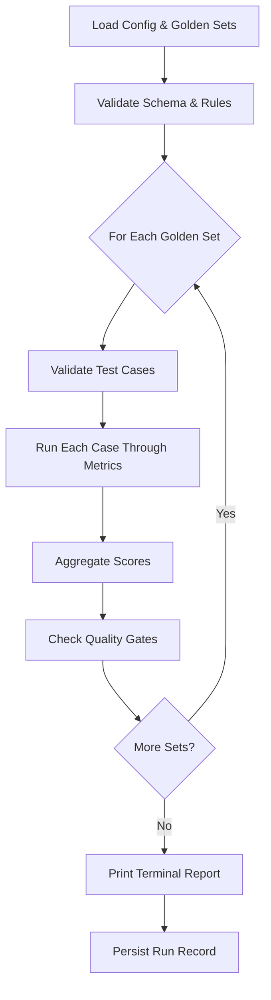

## Synopsis

```bash
regtrace <command> [options]
```

## Global options

<TypeTable
  type={{
    "--config": { description: "Path to config file", type: "string", default: "regtrace.config.yaml" },
    "--verbose": { description: "Enable verbose logging", type: "boolean", default: "false" },
    "--version": { description: "Show version number", type: "boolean" },
    "--help": { description: "Show help", type: "boolean" },
  }}
/>

## Commands

### `init`

```bash
regtrace init
```

Scaffold a new Regtrace project:

- Creates `regtrace.config.yaml` with defaults
- Creates `golden-sets/qa.yaml` with sample test cases
- Creates `.gitignore` with `.regtrace/runs/`
- Creates `.regtrace/runs/` directory

<Callout type="info">
  Required config blocks that must always be present: `metrics.tone`
  (can disable all sub-dimensions to skip tone evaluation) and
  `judge.cost_controls`. Both are populated by `regtrace init`.
</Callout>

### `run`

```bash
regtrace run [options]
```

Run evaluation on all enabled golden sets.

<TypeTable
  type={{
    "--ci": { description: "CI mode: suppress color, exit 1 on quality gate failure", type: "boolean", default: "false" },
    "--no-ci": { description: "Disable CI mode auto-detection", type: "boolean" },
    "--bail": { description: "Stop after first suite that fails quality gates", type: "boolean", default: "false" },
    "--dry-run": { description: "Validate config, golden sets, and environment without evaluating", type: "boolean", default: "false" },
    "--generate": { description: "Generate `actual_output` from LLM for test cases with null output, then evaluate", type: "boolean", default: "false" },
    "--format": { description: "Output format: `terminal`, `json`, `markdown`", type: "string", default: "terminal" },
    "--output": { description: "Write output to file (requires `--format`)", type: "string" },
    "--set": { description: "Run a specific golden set (matches config `path`)", type: "string" },
    "--verbose": { description: "Show all test cases, including passing ones", type: "boolean", default: "false" },
  }}
/>

Steps:



Originally:

#### Dry-run mode

`regtrace run --dry-run` validates the config, golden sets, and schema
without executing any evaluations or spending tokens. It completes in under
two seconds and is the recommended way to verify setup before a full run.

#### CI mode

`--ci` suppresses color output and exits with code 1 when quality gates
fail. CI auto-detection checks `CI`, `GITHUB_ACTIONS`, `GITLAB_CI`, and
`CIRCLECI` environment variables. Use `--no-ci` to override auto-detection.

#### Verbose mode

By default, `regtrace run` only shows failed test cases. Pass `--verbose`
to list all test cases including passing ones.

#### Generate mode

`regtrace run --generate` calls an LLM provider to produce `actual_output`
for test cases where it is `null` in the golden set, then evaluates normally.

The generator defaults to the `judge.primary` provider. Override with an
optional `generator` block in the config file (see
[config file reference](/docs/reference/config-file)). Generated output is
stored in the run record only; the golden set YAML is never modified.

### `list`

```bash
regtrace list [options]
```

List recent evaluation runs.

<TypeTable
  type={{
    "--limit": { description: "Number of runs to show", type: "number", default: "10" },
    "--suite": { description: "Filter by suite name", type: "string" },
    "--status": { description: "Filter by status: `passed`, `failed`", type: "string" },
  }}
/>

### `history`

```bash
regtrace history [options]
```

Show detailed run information.

<TypeTable
  type={{
    "--run-id": { description: "Show detailed results for a specific run", type: "string" },
    "--diff": { description: "Diff against another run. Use `--run-id <a> --diff <b>` for two specific runs", type: "string" },
  }}
/>

### `watch`

```bash
regtrace watch [options]
```

Watch golden set files for changes and re-run evaluation.

<TypeTable
  type={{
    "--config": { description: "Path to config file", type: "string" },
  }}
/>

### `baseline`

```bash
regtrace baseline <subcommand>
```

Manage regression baselines.

| Subcommand | Args | Description |
|---|---|---|
| `pin <run-id>` | Run ID to pin | Pin baseline to a specific run |
| `unpin` | — | Revert to `last_passing` strategy |
| `show` | — | Display current baseline info |

### `db`

```bash
regtrace db rebuild [options]
```

Manage the SQLite run record database.

| Subcommand | Description |
|---|---|
| `rebuild` | Rebuild database from `.regtrace/runs/` JSON files |

Rebuilding imports all existing JSON run records into the SQLite database.
Existing records are replaced. Corrupt files are skipped.

## Quality gates

Quality gates are checked after every run. They determine pass/fail.

See [config file reference](/docs/reference/config-file) for quality gate
options and defaults.

## Exit codes

| Code | Meaning |
|------|---------|
| 0 | All quality gates passed |
| 1 | One or more quality gates failed |
| 2 | Config or schema error — evaluation did not run |

Config and schema errors are distinguished from evaluation failures so that
pipeline logic can react appropriately to each case.
