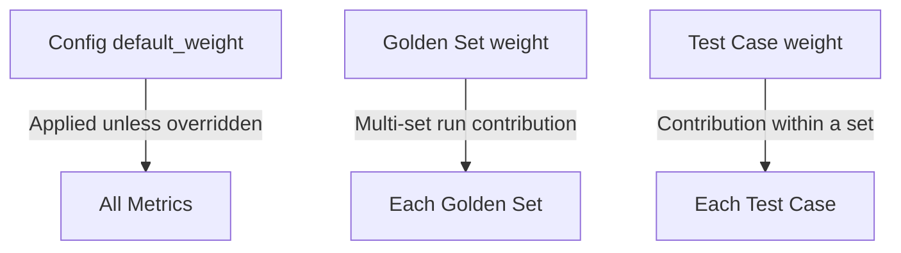

## Location

`regtrace.config.yaml` in the project root. Specify a custom path with
`--config`.

## Schema

```yaml
# Project metadata (optional)
project:
  name: my-eval-project
  version: "1.0.0"

# Golden set entries
golden_sets:
  - path: golden-sets/qa.yaml
    enabled: true
    weight: 1
    store_in_db: true

# Metric configuration
metrics:
  enabled: [factuality, format, tone, regression]
  default_threshold: 0.7
  default_weight: 1

  factuality:
    mode: strict
    claim_extraction_depth: shallow
    rag_faithfulness_only: false

  format:
    sub_checks:
      length: true
      json_validity: false
      json_schema: false
      markdown_structure: false
      required_fields: true
      forbidden_content: true
      regex_match: false
    length_tolerance: 0.3
    strict_json: false

  tone:
    sub_dimensions:
      formality: true
      sentiment: true
      assertiveness: true
      persona_consistency: true
      verbosity: true

  regression:
    enabled: true
    baseline_strategy: last_passing
    tolerance: 0.05
    critical_threshold: 0.15
    exclude_new_test_cases: true

# Judge provider configuration
judge:
  primary:
    provider: anthropic
    model: claude-haiku-4-5-20251001
    temperature: 0.1
    max_tokens: 4096
    timeout_ms: 30000
    retry_attempts: 3
  fallback:
    provider: openai
    model: gpt-5.4-mini-2026-03-17
    temperature: 0.1
    max_tokens: 4096
    timeout_ms: 30000
    retry_attempts: 2
  cost_controls:
    max_tokens_per_run: 100000
    warn_at_tokens: 80000

# Generator provider configuration (optional)
# Falls back to judge.primary when absent
generator:
  provider: groq
  model: llama-3.3-70b-versatile
  temperature: 0.7
  max_tokens: 4096
  timeout_ms: 30000
  retry_attempts: 3

# Runtime configuration
run:
  concurrency: 1

# Quality gates
quality_gates:
  suite_score_minimum: 0.7
  max_failed_test_cases: 0
  max_low_confidence_ratio: 0.1
  regression_gate: true

# Output configuration
output:
  run_history_limit: 50
  default_format: terminal
  color: auto
  ci_mode_auto_detect: true

# Storage configuration (optional)
storage:
  db:
    enabled: false
    path: .regtrace/regtrace.db
```

## Golden set entry

| Field | Type | Default | Description |
|---|---|---|---|
| `path` | string | — | Path to golden set YAML file |
| `enabled` | boolean | `true` | Include this set in evaluations |
| `weight` | number | `1` | Contribution weight in multi-set runs |
| `store_in_db` | boolean | `true` | Persist runs to SQLite database |

## Run configuration

| Field | Type | Default | Description |
|---|---|---|---|
| `concurrency` | integer | `1` | Number of test cases evaluated in parallel per batch. Higher values speed up suites with many LLM-judged metrics. Max: `20`. |

## Quality gates reference

| Gate | Type | Default | Description |
|---|---|---|---|
| `suite_score_minimum` | number | `0.7` | Minimum suite aggregate score (0.0–1.0) |
| `metric_score_minimums` | object | — | Per-metric minimum thresholds |
| `max_failed_test_cases` | integer | `0` | Maximum allowed failed test cases |
| `max_low_confidence_ratio` | number | `0.1` | Max fraction of results with confidence < 0.6 |
| `regression_gate` | boolean | `true` | Fail on critical regression |

## Output configuration

| Field | Type | Default | Description |
|---|---|---|---|
| `run_history_limit` | integer | `50` | Number of run records to retain |
| `default_format` | string | `terminal` | Output format: `terminal`, `json`, `markdown` |
| `color` | string | `auto` | Color mode: `auto`, `always`, `never` |
| `ci_mode_auto_detect` | boolean | `true` | Auto-detect CI environments from env vars |
| `report_path` | string | — | Default report output path |

## Storage configuration

| Field | Type | Default | Description |
|---|---|---|---|
| `db.enabled` | boolean | `false` | Enable SQLite run record persistence |
| `db.path` | string | `.regtrace/regtrace.db` | Database file path |

See the [database reference](/docs/reference/database) for the full schema.

## Weighting

Weights form a three-level cascade:



All weights default to `1`.

## Required blocks

These blocks must always be present in the config. `regtrace init` populates
them with defaults:

| Block | Why required |
|---|---|
| `metrics.tone` | Zod schema requires it. Disable all sub-dimensions to skip tone evaluation. |
| `judge.cost_controls` | Zod schema requires it. Defaults: 100K max tokens, 80K warn threshold. |
| `metrics.factuality` | Required. Defaults: `strict` mode, `shallow` extraction depth. |
| `metrics.format` | Required. Defaults: all 7 sub-checks enabled. |
| `metrics.regression` | Required. Defaults: `last_passing` strategy. |

## Validation

Regtrace validates the config file at startup:

- `golden_sets` must be an array
- Each golden set entry must have `path` (string) and `enabled` (boolean)
- `provider` must be one of: `anthropic`, `openai`, `gemini`, `groq`, `ollama`
- `default_format` must be one of: `terminal`, `json`, `markdown`
- Numbers outside expected ranges produce helpful error messages
- Missing required blocks produce clear error messages naming the missing field
