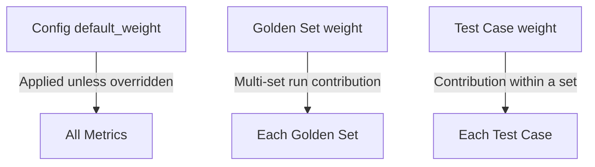

## Location

`regtrace.config.yaml` in the project root. Specify a custom path with
`--config`.

## Schema

```yaml
# Project metadata (optional)
project:
  name: my-eval-project
  version: "1.0.0"

# Golden set entries
golden_sets:
  - path: golden-sets/qa.yaml
    enabled: true
    weight: 1
    store_in_db: true

# Metric configuration
metrics:
  enabled: [factuality, format, tone, regression]
  default_threshold: 0.7
  default_weight: 1

  factuality:
    mode: strict           # strict | lenient | json_structural
    claim_extraction_depth: shallow
    rag_faithfulness_only: false

  format:
    sub_checks:
      length: true
      json_validity: false
      json_schema: false
      markdown_structure: false
      required_fields: true
      forbidden_content: true
      regex_match: false
    length_tolerance: 0.3
    strict_json: false

  tone:
    sub_dimensions:
      formality: true
      sentiment: true
      assertiveness: true
      persona_consistency: true
      verbosity: true

  regression:
    enabled: true
    baseline_strategy: last_passing
    tolerance: 0.05
    critical_threshold: 0.15
    exclude_new_test_cases: true
    branch_aware: true
    fallback_baseline: main

# Judge provider configuration
judge:
  primary:
    provider: anthropic
    model: claude-haiku-4-5-20251001
    temperature: 0.1
    max_tokens: 4096
    timeout_ms: 30000
    retry_attempts: 3
  fallback:
    provider: openai
    model: gpt-5.4-mini-2026-03-17
    temperature: 0.1
    max_tokens: 4096
    timeout_ms: 30000
    retry_attempts: 2

# Generator provider configuration (optional)
# Falls back to judge.primary when absent
generator:
  provider: anthropic
  model: claude-haiku-4-5-20251001
  temperature: 0.4
  max_tokens: 4096
  timeout_ms: 60000
  retry_attempts: 3

# Runtime configuration
run:
  concurrency: 4

# NFR gates (optional)
nfr_gates:
  max_latency_ms: 30000
  max_cost_usd: 0.50
  min_coverage: 0.8

# Quality gates
quality_gates:
  suite_score_minimum: 0.7
  max_failed_test_cases: 0
  max_low_confidence_ratio: 0.1
  regression_gate: true

# Output configuration
output:
  run_history_limit: 50
  default_format: terminal
  color: auto
  ci_mode_auto_detect: true

# Storage configuration (optional)
storage:
  db:
    enabled: false
    path: .regtrace/regtrace.db
```

## Generator block

| Field | Type | Default | Description |
|---|---|---|---|
| `provider` | string | — | Provider name: `anthropic`, `openai`, `gemini`, `groq`, `ollama` |
| `model` | string | — | Model identifier (e.g. `claude-haiku-4-5-20251001`) |
| `temperature` | number | `0.1` | Generation temperature (0–2). Higher values increase creativity. Use `0.1` for factual tasks, `0.4` for creative writing. |
| `max_tokens` | integer | `4096` | Maximum response tokens |
| `timeout_ms` | integer | `30000` | Request timeout in milliseconds |
| `retry_attempts` | integer | `3` | Retries on failure |

When `generator` is absent, `regtrace run --generate` falls back to
`judge.primary`. Generated output is stored in the run record only;
golden set YAML files are never modified.

## Golden set entry
|---|---|---|---|
| `path` | string | — | Path to golden set YAML file |
| `enabled` | boolean | `true` | Include this set in evaluations |
| `weight` | number | `1` | Contribution weight in multi-set runs |
| `store_in_db` | boolean | `true` | Persist runs to SQLite database |

## Run configuration

| Field | Type | Default | Description |
|---|---|---|---|
| `concurrency` | integer | `4` | Number of test cases evaluated in parallel per batch. Higher values speed up suites with many LLM-judged metrics. Max: `20`. |

## Quality gates reference

| Gate | Type | Default | Description |
|---|---|---|---|
| `suite_score_minimum` | number | `0.7` | Minimum suite aggregate score (0.0–1.0) |
| `metric_score_minimums` | object | — | Per-metric minimum thresholds. See example below. |
| `max_failed_test_cases` | integer | `0` | Maximum allowed failed test cases |
| `max_low_confidence_ratio` | number | `0.1` | Max fraction of results with confidence < 0.6 |
| `regression_gate` | boolean | `true` | Fail on critical regression |

Example — factuality must score 80%+ and format 60%+:

```yaml
quality_gates:
  suite_score_minimum: 0.7
  metric_score_minimums:
    factuality: 0.8
    format: 0.6
  max_failed_test_cases: 1
  max_low_confidence_ratio: 0.1
  regression_gate: true
```

## NFR gates

Non-functional requirement gates expand pass/fail beyond output quality to
latency, API cost, and test coverage. When any NFR gate fails, the suite
fails — same as quality gates.

| Gate | Type | Description |
|---|---|---|
| `max_latency_ms` | integer | Maximum wall-clock duration for the full evaluation run (milliseconds) |
| `max_cost_usd` | number | Maximum total API cost across all LLM-judged metrics (USD) |
| `min_coverage` | number | Minimum fraction of passing test cases (0.0–1.0) |

NFR gates are optional. Omit the block entirely to skip all NFR checks.

## Output configuration

| Field | Type | Default | Description |
|---|---|---|---|
| `run_history_limit` | integer | `50` | Number of run records to retain |
| `default_format` | string | `terminal` | Output format: `terminal`, `json`, `markdown` |
| `color` | string | `auto` | Color mode: `auto`, `always`, `never` |
| `ci_mode_auto_detect` | boolean | `true` | Auto-detect CI environments from env vars |
| `report_path` | string | — | Default report output path. Overridden by `--output` flag. |

## Tone configuration

| Field | Type | Default | Description |
|---|---|---|---|
| `tone_profile` | string or null | — | Expected tone description passed to the LLM judge. E.g. `"confident, approachable, professional"`. |
| `sub_dimensions` | object | all `true` | Per-dimension toggle: `formality`, `sentiment`, `assertiveness`, `persona_consistency`, `verbosity` |
| `sub_dimension_weights` | object | — | Custom weight per dimension. E.g. `{ formality: 2.0, verbosity: 0.5 }` |

Example — custom profile per dimension weights:

```yaml
tone:
  tone_profile: "friendly but professional, concise"
  sub_dimensions:
    formality: true
    sentiment: true
    persona_consistency: true
  sub_dimension_weights:
    formality: 1.5
    verbosity: 0.3
```

## Storage configuration

| Field | Type | Default | Description |
|---|---|---|---|
| `db.enabled` | boolean | `false` | Enable SQLite run record persistence |
| `db.path` | string | `.regtrace/regtrace.db` | Database file path |

See the [database reference](/docs/reference/database) for the full schema.

## Weighting

Weights form a three-level cascade:



All weights default to `1`.

## Regression configuration

| Field | Type | Default | Description |
|---|---|---|---|
| `enabled` | boolean | `true` | Enable regression detection |
| `baseline_strategy` | string | `last_passing` | `last_passing` or `pinned` |
| `pinned_run_id` | string | — | Run ID to pin as baseline (required when `strategy: pinned`) |
| `tolerance` | number | `0.05` | Score delta threshold for clean regression (±5%) |
| `metric_tolerances` | object | — | Per-metric tolerance overrides. E.g. `{format: 0, factuality: 0.1}` means zero format drift allowed but 10% factuality variance OK |
| `critical_threshold` | number | `0.15` | Score delta threshold for critical regression (±15%) |
| `exclude_new_test_cases` | boolean | `true` | Exclude new test case IDs from regression comparison |
| `branch_aware` | boolean | `true` | Auto-detect current git branch. Feature branches fall back to `fallback_baseline`. |
| `fallback_baseline` | string | `main` | Branch name to use as fallback baseline when no baseline exists for the current branch |

## Required blocks

These blocks must always be present in the config. `regtrace init` populates
them with defaults:

| Block | Why required |
|---|---|
| `metrics.tone` | Zod schema requires it. Disable all sub-dimensions to skip tone evaluation. |
| `metrics.factuality` | Required. Defaults: `strict` mode, `shallow` extraction depth. |
| `metrics.format` | Required. Defaults: all 7 sub-checks enabled. |
| `metrics.regression` | Required. Defaults: `last_passing` strategy. |

## Validation

Regtrace validates the config file at startup:

- `golden_sets` must be an array
- Each golden set entry must have `path` (string) and `enabled` (boolean)
- `provider` must be one of: `anthropic`, `openai`, `gemini`, `groq`, `ollama`
- `default_format` must be one of: `terminal`, `json`, `markdown`
- Numbers outside expected ranges produce helpful error messages
- Missing required blocks produce clear error messages naming the missing field
