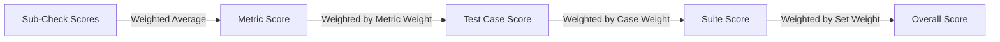

## Metric types

| Metric | Type | Deterministic | Requires LLM judge |
|---|---|---|---|
| Factuality | LLM-judged | No | Yes (deep mode) |
| Format | Deterministic | Yes | No |
| Tone | LLM-judged | Partial | Yes |
| Regression | Statistical | Yes | No |

## Factuality

Evaluates whether the actual output is factually correct against the expected
output or context.

**Modes:**

| Mode | Behavior |
|---|---|
| `strict` | Fail on contradicted claims AND unverifiable claims |
| `lenient` | Fail only on contradicted claims |
| `json_structural` | Auto-detected when both expected and actual parse as JSON. Compares each leaf value type-appropriately (string exact, number within 0.01, boolean exact). Arrays of primitives use set-based comparison (order-independent), arrays of objects use positional. Reports specific mismatches in explanations. Falls back to n-gram overlap for non-JSON. |

<Callout type="info">
  JSON auto-detection triggers in any mode when both expected and actual output
  are valid JSON. Explicitly setting `json_structural` forces this comparison
  and produces a diagnostic error if either value isn't JSON.
</Callout>

**Claim extraction:**

| Depth | Behavior |
|---|---|
| `shallow` (default) | Heuristic N-gram overlap. Deterministic, no API call. |
| `deep` | Use LLM to extract claims (requires configured judge provider). |

If no LLM provider is configured or the API call fails, factuality falls back
to heuristic (`shallow`) scoring regardless of the configured depth.

**Scoring:**

- Score = ratio of supported claims to total claims
- Contradicted and unverifiable claims each contribute to the failure count

## Format

Deterministic structural checks on the actual output.

**Sub-checks:**

| Sub-check | What it does |
|---|---|
| `length` | Compares output length to expected; tolerance controls allowed deviation |
| `json_validity` | Checks if output is valid JSON |
| `json_schema` | Validates JSON against a schema derived from the expected output |
| `markdown_structure` | Checks heading hierarchy, list formatting |
| `required_fields` | Checks specific terms appear in output |
| `forbidden_content` | Checks specific terms do NOT appear |
| `regex_match` | Checks output matches a regex pattern (patterns > 500 chars rejected; complex quantified patterns rejected as ReDoS protection) |

**Scoring:**

- Score = (passed sub-checks) / (total sub-checks)
- 1.0 if all enabled sub-checks pass

## Tone

Evaluates the tone and voice of the actual output against expectations.

**Sub-dimensions:**

| Dimension | What it checks |
|---|---|
| `formality` | Formal vs informal register |
| `sentiment` | Positive, negative, or neutral sentiment |
| `assertiveness` | Confident vs tentative language |
| `persona_consistency` | Consistent voice matching the tone profile |
| `verbosity` | Appropriate level of detail |

**Scoring:**

Weighted average of active sub-dimensions. Default weights are 1.0 for all.

**Judge fallback:**

When the LLM judge is unavailable, tone uses heuristic rules:
- `formality`: Ratio of formal hedging terms
- `sentiment`: Keyword-based scoring
- `verbosity`: Word and sentence length ratios

## Regression

Statistical comparison against a baseline run.

**Strategies:**

| Strategy | Description |
|---|---|
| `last_passing` | Compare against most recent passing run |
| `pinned` | Compare against a specific pinned run |

**Statuses:**

| Status | Condition |
|---|---|
| `clean` | No significant delta or improvement |
| `warning` | Delta below `tolerance` (above threshold) |
| `critical` | Delta below `critical_threshold` |
| `new` | No baseline exists for comparison |

**Test case deltas:**

| Delta | Condition |
|---|---|
| `improved` | Score increased |
| `regressed` | Score decreased |
| `unchanged` | Score unchanged |
| `new` | Test case didn't exist in baseline |
| `removed` | Test case existed in baseline but not in current |

## Scoring cascade

Scoring method: `weighted_average` (default). All weights default to `1`.

## Assertion-level details

For deterministic metrics (format sub-checks, JSON factuality comparisons), each
metric result includes an optional `details[]` array. Each entry describes a
single assertion:

| Field | Type | Description |
|---|---|---|
| `check` | string | Hierarchical check name (e.g. `format.length`, `json_path.$.amount`) |
| `passed` | boolean | Whether this specific assertion passed |
| `expected` | string (optional) | Expected value (truncated to 80 chars) |
| `actual` | string (optional) | Actual value (truncated to 80 chars) |
| `message` | string (optional) | Human-readable description |

Up to 10 mismatches are reported per metric. Beyond 10, a `+ N more` entry
summarizes the rest.

In markdown reports, failed details are shown in collapsible sections per
metric. In JSON output, the full `details[]` array is included in the
`metric_results` object.
