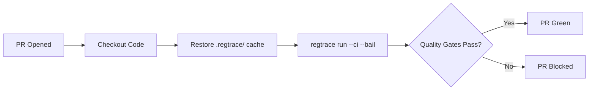

# PR Regression Gate

Blocks pull requests when LLM output quality drops below strict thresholds.
Catches prompt edits, model swaps, or config changes that degrade responses before
they reach production.

## When to use this

Use when you ship prompt or model changes via PRs and want to prevent regressions
from merging. Best for teams that:

- Iterate on system prompts for customer-facing LLM features
- Swap between LLM models (e.g., testing a cheaper model)
- Need to enforce a minimum quality bar across every change

## Prerequisites

- `secrets.ANTHROPIC_API_KEY` set in your GitHub repository
- All test cases have filled `actual_output` (no `--generate` needed)
- `golden-sets/qa.yaml` and `regtrace.config.yaml` committed in `examples/pr-regression-gate/`

## How it works



## Key flags

| Flag | Purpose |
|------|---------|
| `--ci` | Suppress color, exit 1 on quality gate failure |
| `--bail` | Stop after first failing suite (saves pipeline time) |

## Quality gates

| Gate | Value | Why |
|------|-------|-----|
| `suite_score_minimum` | 0.8 | High bar for PR changes |
| `factuality` | 0.85 | Critical for customer-facing answers |
| `format` | 0.8 | Responses must include required fields |
| `max_failed_test_cases` | 0 | Every case must pass |
| `regression_gate` | true | Score drop of 10%+ blocks merge |

## Run locally first

```bash
cd examples/pr-regression-gate
export ANTHROPIC_API_KEY=sk-ant-...
regtrace run
```

Verify all test cases pass before pushing to CI. If any fail, adjust your
prompt or golden set expectations.
